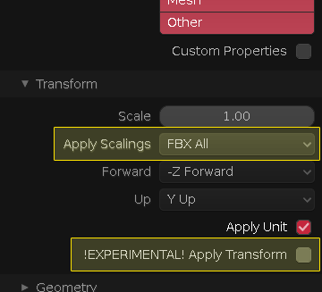

# blender_unity_rotation_fix
Rotation fix for exporting from Blender to Unity

This plugin basically swaps Y and Z axes to be compatible with Unity's orientation, while taking hierarchies and already present rotations into account. This plugin has been created out of need for reliable deeply nested hierarchy fbx exporting, which with standard "Apply Transform" option gets broken at 2nd child. This plugin only deals with rotations and not positions nor scales.

### How to use

This plugin is only compatible with Blender 2.8+ versions.

Add it through Edit > Preferences > Add-ons. When you install it, "Unity Rotation Fix" option will appear in Object > Apply menu (default hotkey: CTRL + A). Alternatively you can also use the search bar and look for "Apply Unity Rotation Fix".

Important: When exporting fbx, make sure that:
- "Apply Scalings" is set to "FBX All" (otherwise the root object will have scale of 100 in Unity), and
- "Apply Transform" option is OFF

